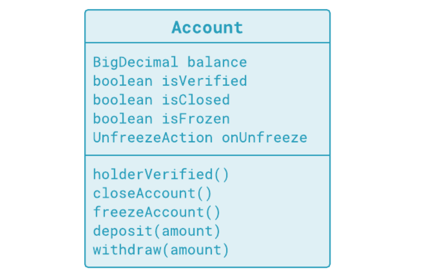
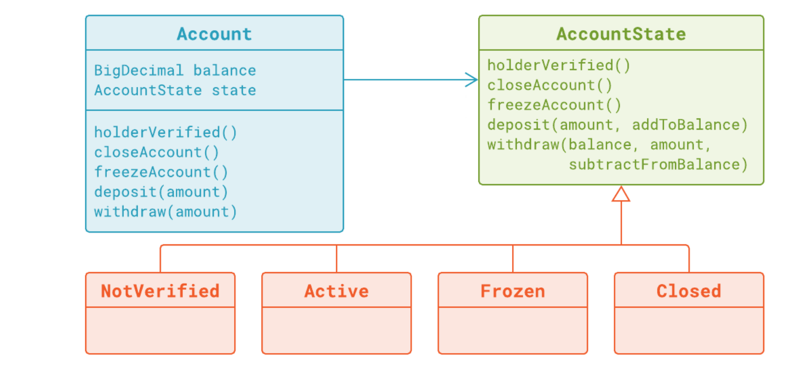

## Module-1 : Rendering Branching over Boolean-Flags-Obsolete : [here](https://github.com/HeithemLejmi/Making-Your-Java-Code-More-Object-oriented/blob/feat/implement_state_design_pattern/docs/module-1__rendering-branching-over-boolean-flags-obsolete-slides.pdf)

### Requirements:

- A client can always deposit money anytime he want (no restrictions)
- But a client can withdraw money, only after his account had been verified (after checking his ID card once)
- A client can close his account. But if the account is closed: the client can't deposit or withdraw from this account any longer.
- the account could be frozen if the client didn't use his account for long period of time:
  - To froze an account, this last should be a verified account first, and it shouldn( be closed)
  - once the client deposit or withdraw money, the frozen account should be unfrozen again
  
### New rules learned:

##### 1. Use **Helper method** like ensureUnfrozen(), instead of having a repetitive code everywhere in your class :

  - Before extracting the repetitive code and put it in a private helper method:

```java
public void deposit(DigDecimal amount){
  if (this.isClosed){
    return;
  }
  /* repetitive code */
  if(this.Frozen){
    this.isFrozen = false;
    this.onUnFrozen.handle();
  }
  /* end of repetitive code */
  this.balance = this.balance.add(amount);
}

public void withdraw(DigDecimal amount){
  if (this.isClosed){
    return;
  }
  if (!this.isVerified){
    return;
  }
  /* repetitive code */
  if(this.Frozen){
    this.isFrozen = false;
    this.onUnFrozen.handle();
  }
  /* end of repetitive code */
  this.balance = this.balance.substract(amount);
}
```

  - After extracting the repetitive code and put it in a private helper method:
```java
public void deposit(DigDecimal amount){
  if (this.isClosed){
    return;
  }
  this.ensureUnFrozen(); // call the helper method 
  this.balance = this.balance.add(amount);
}

public void withdraw(DigDecimal amount){
  if (this.isClosed){
    return;
  }
  if (!this.isVerified){
    return;
  }
  this.ensureUnFrozen(); // call the helper method 
  this.balance = this.balance.substract(amount);
}

/* private helper method */
private void ensureUnFrozen(){
  if(this.Frozen){
    this.isFrozen = false;
    this.onUnFrozen.handle();
  }
}
```
##### 2. Use **Guard Clause** instead of having an if..else clauses:
- the **Guard Clause** will be at the very beginning of your method, and it will test whether the precondition(s) for this method are satisfied or not:
For example, for the ensureUnfrozen() method, the precondition is **the account is already frozen**:
the **Guard Clause** should check **if the account is frozen**, then it will *allow the pursuit the method*, if it is not *it terminates the method* (get out the method and do nothing):
  - Before adding the **Guard Clause** :
```java
private void ensureUnFrozen(){
  if(this.Frozen){
    this.isFrozen = false;
    this.onUnFrozen.handle();
  } else {
    return;
  }

}
```
  - After adding the **Guard Clause** :
```java
private void ensureUnFrozen(){
  // Guard Clause
  if(!this.Frozen){
    return;
  }
  this.isFrozen = false;
  this.onUnFrozen.handle();
}
```
##### 3. The methods handeling the aspects of each state (the state isFrozen for example) will be extracted from the class
 **Account**, and we will create an interface that mentions the signature of these methods for handeling this state. 
And the implementation of this interface (and its methods) should only know **how something happens** (how the Frozen state changes in every case: deposit(), withdraw(), freezeAccount()) and we will leave it to the caller (in this case the **Account** class) to decide **when it happens** (when he calls these methods).

This will reduce the complexity in the **Account** class and it will transfer the **responsability** of handeling the **Frozen** state in an appropriate interface (and its implementation will details the actions driven by these methods).


##### 4. Apply the **State Design Pattern**, to control brabching complexity:

- Before implementing the State Pattern: 

In this module we have seen an example of one class which was trying to do everything by itself. 
One of the issues with this class was that implementation of its methods was greatly based on if/else instructions (each time we check at which state we are: closed, verified, frozen, ...) :

The original implementation was object, based, but not object-oriented. Look at the class diagram. 
One class (**Account Class**) and that is all. All functionality was dumped into this single class. It is not object-oriented programming. 



- After implementing the State Pattern: 

And let's see the class diagram for the final solution. In a couple of refactorings that followed, you could see the process of **moving operations into external states**:



We still have the **Account** class, but a substantial part of the domain logic has been moved out to smaller classes (Frozen, Active, Closed, ...) and replaced with the account state interface. 
  - Current state of the object was represented by a current reference to a state object: **AccountState** 
  - If the state was to be changed as a result of some operation, the underlying reference to the state object would change. 

This design is **more object-oriented** if for no other reason than because we **finally have objects**. Furthermore, several other benefits naturally come out from such approach: 
  - Take one final look at the **Account** class before we close this module. What is this class doing now? **Account** Class becomes simple now and focused on its primary role: managing the balance and nothing more. 
  
  - All other behavior were just delegated to a single object it refers the current state : **AccountState**.
      - Secondary roles are delegated to others classes (the state classes: Frozen, Closed, Active, ..). 
      - Each of those others by itself will become simple and focused on its own primary role.
      
##### 5. Using the Consumer<T>
- The **Consumer Interface** is a part of the **java.util.function** package which has been introduced since Java 8, to
 implement **functional programming** in Java.
 
- **Consumer** represents a function which takes in one argument and produces a result. However these kind of functions don’t
 return any value. In the example below, the **Consumer** represents the function **addToBalance** and takes one argument
  **BigDecimal** (which is the argument of the represented function: **addToBalance**) and it returns no value (we
   only call it like this: **addToBalance.accept(amount)**)

- The Consumer interface has the following function **.accept()**:

    - accept(): This method accepts **one parameter** and performs the operation on the given argumentdoes not return any value (in this example: it
    accepts one argument : **amount** of type **BigDecimal**, and it performs the operation **addToBalance** on this argument
    **amount**)
    
    - First, we define the method deposit(BigDecimal, Consumer<BigDecimal>) in the AccountState class:
 ```java
public class Active implements AccountState {
  @Override
    public AccountState deposit(BigDecimal amount, Consumer<BigDecimal> addToBalance) {
      addToBalance.accept(amount);
      return this;
    }
}
 ```
    - And then we call the deposit(BigDecimal, Consumer<BigDecimal>) in the Account.deposit(BigDecimal) method:
 ```java
public class Account {

  private BigDecimal balance;
  private AccountState state;

  public void deposit(BigDecimal amount) {
    this.state = this.state.deposit(amount, this::addToBalance);
  }
}
 ```